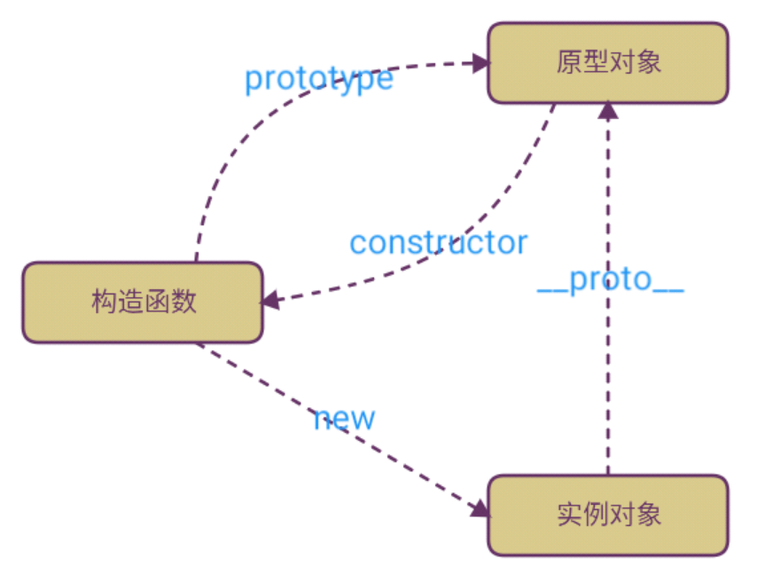

# 奇怪的面向对象

## 介绍

JavaScript的所有数据都可以看成对象。她的面向对象编程和大多数其他语言如Java、C#的面向对象编程都不太一样。如果你熟悉Java或C#，很好，你一定明白面向对象的两个基本概念：
1. 类：类是对象的类型模板，例如，定义`Student`类来表示学生，类本身是一种类型，`Student`表示学生类型，但不表示任何具体的某个学生
2. 实例：实例是根据类创建的对象，例如，根据`Student`类可以创建出`xiaoming`、`xiaohong`、`xiaojun`等多个实例，每个实例表示一个具体的学生，他们全都属于`Student`类型。

不过，在JavaScript中，这个概念需要改一改。JavaScript不区分类和实例的概念，而是通过原型（prototype）来实现面向对象编程。

## 构造函数

除了直接用{ ... }创建一个对象外，JavaScript还可以用一种构造函数的方法来创建对象。它的用法是，先定义一个构造函数，然后用关键字new来调用这个函数，并返回一个对象

```js
function Student(name) {
    this.name = name;
    this.hello = function () {
        alert('Hello, ' + this.name + '!');
    }
}

var xiaoming = new Student('小明');
xiaoming.name; // '小明'
xiaoming.hello(); // Hello, 小明!
```

注意，如果不写`new`，这就是一个普通函数，它返回`undefined`。但是，如果写了`new`，它就变成了一个构造函数，它绑定的`this`指向新创建的对象，并默认返回`this`，也就是说，不需要在最后写`return this;`。

新创建的`xiaoming`的原型链是

```js
xiaoming ----> Student.prototype ----> Object.prototype ----> null
```

## 冷静

好了，你现在可能接触了一大段不清楚的名词，解释一下。

* 实例

和普通的面向对象概念并无差异，上述例子中，`xiaoming`是一个实例。

* 原型对象

每个实例化的对象都有一个参数`__proto__`，指向其**原型对象**。**原型对象**下面所有的方法或变量，都能被所有用对应构造方法实例化出来的实例调用。用人话说，`xiaoming`、`xiaohong`、`xiaojun`使用构造方法`Student()`都可以通过`__proto__`找到他们共同指向的那个原型对象。

* 构造方法

创建一个对象时候需要使用的方法，一般配合关键字`new`使用。

> 它们之间的联系

现在开始有点绕了！

1. 构造方法`Student`都有一个`prototype`（原型）对象。
2. 构造方法创建的实例们`xiaoming`、`xiaohong`、`xiaojun`可以使用`__proto__`找到它们共同指向的那个原型对象。
3. 构造方法的`prototype`与实例的`__proto__`指向的是同一个东西
4. 原型对象的`constructor`指向构造方法`Student`
5. `prototype`对象相当于特定类型所有实例对象都可以访问的公共容器

来张图环节一下压力吧，务必梳理清楚他们之间的关系。初学者对于这些概念可以用C语言指针的思想去理解理解。



看一下代码就清楚了

```js
function Person(nick, age){
    this.nick = nick;
    this.age = age;
}
Person.prototype.sayName = function(){
    console.log(this.nick);
}

var p1 = new Person('Byron', 20);

var p2 = new Person('Casper', 25);

p1.sayName()  // Byron

p2.sayName()  // Casper

p1.__proto__ === Person.prototype       //true

p2.__proto__ === Person.prototype   //true

p1.__proto__ === p2.__proto__           //true

Person.prototype.constructor === Person  //true
```

注意！

> 当`Object.prototype.__proto__` 已被大多数浏览器厂商所支持的今天，其存在和确切行为仅在ECMAScript 2015规范中被标准化为传统功能，以确保Web浏览器的兼容性。为了更好的支持，建议只使用 `Object.getPrototypeOf()`。

> `Object.create(null)` 新建的对象是没有`__proto__`属性的。

## 原型链

当试图访问一个对象的属性时，它不仅仅在该对象上搜寻，还会搜寻该对象的原型，以及该对象的原型的原型，依次层层向上搜索，直到找到一个名字匹配的属性或到达原型链的末尾。

当我们用`obj.xxx`访问一个对象的属性时，JavaScript引擎先在当前对象上查找该属性，如果没有找到，就到其原型对象上找，如果还没有找到，就一直上溯到`Object.prototype`对象，最后，如果还没有找到，就只能返回`undefined`。

例如一个Array对象的原型链是：

```js
var arr = [1, 2, 3];
arr ----> Array.prototype ----> Object.prototype ----> null
```

**所有对象（实例）可以访问共同的原型方法**。由于`Array.prototype`定义了`indexOf()`、`shift()`等方法，因此你可以在所有的`Array`对象上直接调用这些方法。

很容易想到，如果原型链很长，那么访问一个对象的属性就会因为花更多的时间查找而变得更慢，因此要注意不要把原型链搞得太长。

## 继承

继承是指一个对象直接使用另外一个对象的属性和方法，由此可见只要实现属性和方法的继承，就达到继承的效果。
* 得到一个对象的属性
* 得到一个对象的方法

### 继承属性

我们先创建一个`Person`类

```js
function Person (name, age) {
    this.name = name
    this.age = age
}

// 方法定义在构造函数的原型上
Person.prototype.getName = function () { console.log(this.name)}
```

此时我想创建一个`Teacher`类，我希望它可以继承`Person`所有的属性，并且额外添加属于自己特定的属性；

一个新的属性，`subject`——这个属性包含了教师教授的学科。


定义`Teacher`的构造函数

```js
function Teacher (name, age, subject) {
    Person.call(this, name, age)
    this.subject = subject
}
```

属性的继承是通过在一个类内执行另外一个类的构造函数，通过`call`指定`this`为当前执行环境，这样就可以得到另外一个类的所有属性。

```js
Person.call(this, name, age)
```

我们实例化一下看看

```js
var teacher = new Teacher('jack', 25, Math)

teacher.age // 25
teacher.name // "jack"
```

很明显Teacher成功继承了Person的属性

## 继承方法

我们需要让`Teacher`从`Person`的原型对象里继承方法，要怎么做呢？

我们都知道类的方法都定义在`prototype`里，那其实只需要把`Person.prototype`的备份赋值给`Teacher.prototype`即可

```js
Teacher.prototype = Object.create(Person.prototype)
```

`Object.create`简单说就是新建一个对象，使用现有的对象赋值给新建对象的`__proto__`

可能有人会问为什么是备份呢？

因为如果直接赋值，那会是引用关系，意味着修改`Teacher.prototype`，也会同时修改`Person.prototype`，这是不合理的。

另外注意一点就是，在给`Teacher`类添加方法时，应该在修改`prototype`以后，否则会被覆盖掉，原因是赋值前后的属性值是不同的对象。

最后还有一个问题，我们都知道`prototype`里有个属性`constructor`指向构造函数本身，但是因为我们是复制其他类的`prototype`，所以这个指向是不对的，需要更正一下。
如果不修改，会导致我们类型判断出错

```js
Teacher.prototype.constructor = Teacher
```

所以实现继承方法的最终方案是！

```js
Teacher.prototype = Object.create(Person.prototype)
Teacher.prototype.constructor = Teacher
```

## ES6中的语法糖

可以使用`class`和`extends`关键字，然后就和普通的面向对象语言一样了！

ES6引入的`class`和原有的JavaScript原型继承，实际上它们没有任何区别，`class`的作用就是让JavaScript引擎去实现原来需要我们自己编写的原型链代码。简而言之，用`class`的好处就是极大地简化了原型链代码。


```js
class Teacher extends Person {
    constructor (name, age, subject) {
        super(name, age); // 调用父类构造方法
        this.subject = subject;
    }

    getName () {
        return this.name;
    }
}
```

## hasOwnProperty

在原型链上查询属性比较耗时，对性能有影响，试图访问不存在的属性时会遍历整个原型链。

遍历对象属性时，每个可枚举的属性都会被枚举出来。 要检查是否具有自己定义的属性，而不是原型链上的属性，必须使用`hasOwnProperty`方法。

`hasOwnProperty`是JavaScript中唯一处理属性并且不会遍历原型链的方法。

## 总结

`prototype`和`__proto__`

每个对象都有一个`__proto__`属性，并且指向它的`prototype`原型对象
每个构造函数都有一个`prototype`原型对象
`prototype`原型对象里的`constructor`指向构造函数本身


原型链
每个对象都有一个`__proto__`，它指向它的`prototype`原型对象，而`prototype`原型对象又具有一个自己的`prototype`原型对象，就这样层层往上直到一个对象的原型`prototype`为`null`

这个查询的路径就是原型链

JavaScript 中的继承
* 属性继承

```js
function Person (name, age) {
    this.name = name
    this.age = age
}

// 方法定义在构造函数的原型上
Person.prototype.getName = function () { console.log(this.name)}

function Teacher (name, age, subject) {
    Person.call(this, name, age)
    this.subject = subject
}
```
* 方法继承

```js
Teacher.prototype = Object.create(Person.prototype)
Teacher.prototype.constructor = Teacher
```

## 复述指引

* 原型、原型对象、构造函数它们之间的关系
* 如何不用ES6中的`Class`、`Extends`关键字实现基础