# Flex布局

Flex十分简单灵活，区区简单几行代码就可以实现各种页面的的布局。如果你深受其 float、display、position 这些属性的困扰，那么学习 Flex 布局，你只要学习几个 CSS 属性，就可以写出简洁优雅复杂的页面布局。

## Flex基本概念

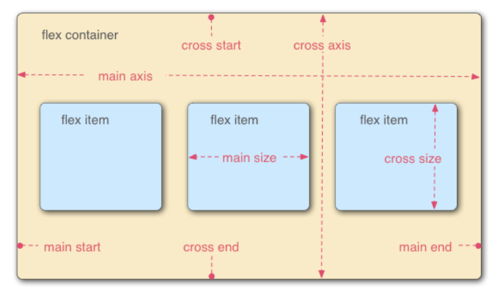

在 flex 容器中默认存在两条轴，水平主轴(main axis) 和垂直的交叉轴(cross axis)

在容器中的每个单元块被称之为 flex item，每个项目占据的主轴空间为 (main size), 占据的交叉轴的空间为 (cross size)。

这里需要强调，不能先入为主认为宽度就是 main size，高度就是 cross size，这个还要取决于你主轴的方向，如果你垂直方向是主轴，那么项目的高度就是 main size。

## Flex 容器

首先，实现 flex 布局需要先指定一个容器，任何一个容器都可以被指定为 flex 布局，这样容器内部的元素就可以使用 flex 来进行布局。

```css
.container {
    display: flex | inline-flex;       //可以有两种取值
}
```

分别生成一个块状或行内的 flex 容器盒子。简单说来，如果你使用块元素如 div，你就可以使用 flex，而如果你使用行内元素，你可以使用 `inline-flex`。

**需要注意的是，当时设置 flex 布局之后，子元素的 float、clear、vertical-align 的属性将会失效。**

有下面六种属性可以设置在容器上，它们分别是：

1. `flex-direction`: 决定主轴的方向(即项目的排列方向)

```css
.container {
    flex-direction: row | row-reverse | column | column-reverse;
}
```

`row`（默认值），主轴为水平方向，起点在左端。

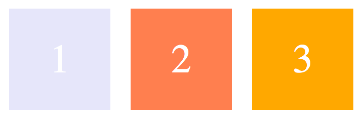

`row-reverse`：主轴为水平方向，起点在右端

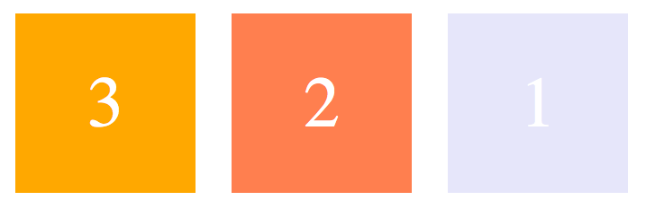

`column`：主轴为垂直方向，起点在上沿

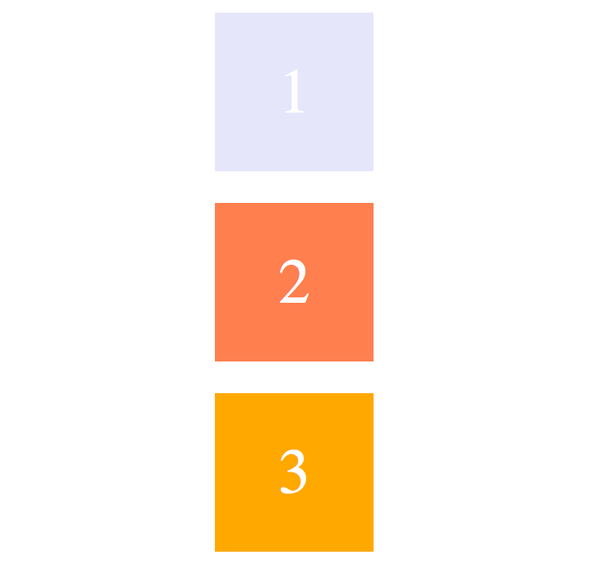

`column-reverse`：主轴为垂直方向，起点在下沿

图略。

2. `flex-wrap`: 决定容器内项目是否可换行

默认情况下，项目都排在主轴线上，使用 `flex-wrap` 可实现项目的换行。

```css
.container {
    flex-wrap: nowrap | wrap | wrap-reverse;
}
```

`nowrap` （默认值）不换行，即当主轴尺寸固定时，当空间不足时，项目尺寸会随之调整而并不会挤到下一行。

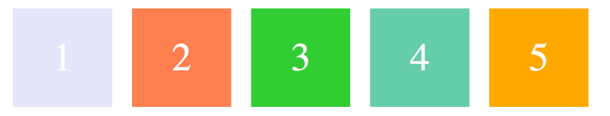

`wrap`：项目主轴总尺寸超出容器时换行，第一行在下方

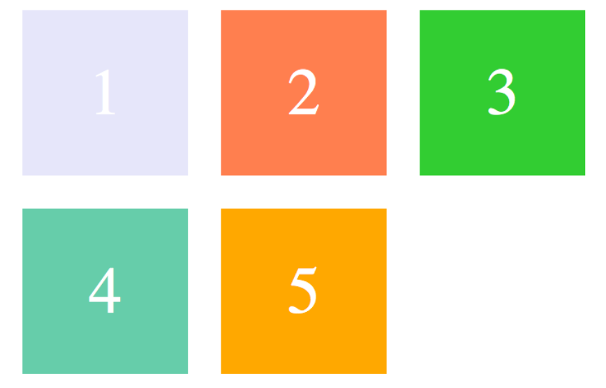

`wrap-reverse`：换行，第一行在上方


3. `flex-flow`: 是 `flex-direction` 和 `flex-wrap` 的简写形式

```css
.container {
    flex-flow: <flex-direction> || <flex-wrap>;
}
```

默认值为: `row nowrap`，感觉没什么用，老老实实分开写就好了。这样就不用记住这个属性了。

4. `justify-content`：定义了项目在主轴的对齐方式。

```css
.container {
    justify-content: flex-start | flex-end | center | space-between | space-around;
}
```

`flex-start` （默认值）左对齐


`flex-end`：右对齐


`center`：居中


`space-between`：两端对齐，项目之间的间隔相等，即剩余空间等分成间隙。


`space-around`：每个项目两侧的间隔相等，所以项目之间的间隔比项目与边缘的间隔大一倍。


5. `align-items`: 定义了项目在交叉轴上的对齐方式

```css
.container {
    align-items: flex-start | flex-end | center | baseline | stretch;
}
```

`stretch` （默认值） ：如果项目未设置高度或者设为 `auto`，将占满整个容器的高度。

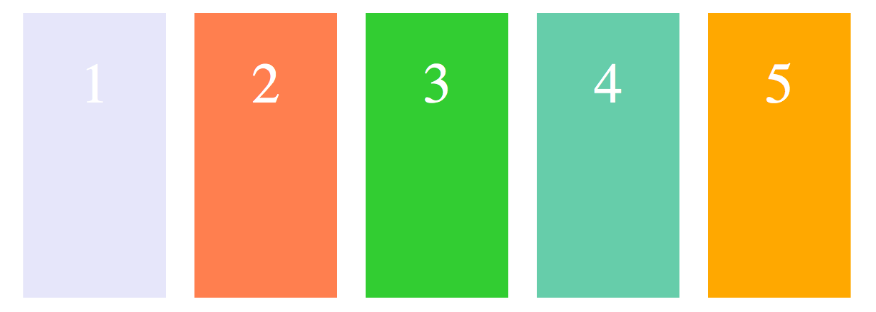

假设容器高度设置为 `100px`，而项目都没有设置高度的情况下，则项目的高度也为 `100px`。

`flex-start`：交叉轴的起点对齐

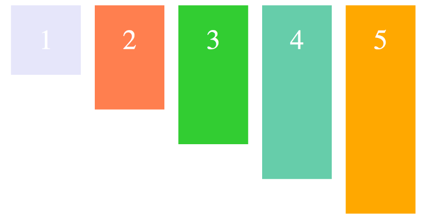

假设容器高度设置为 `100px`，而项目分别为 `20px`, `40px`, `60px`, `80px`, `100px`, 则如上图显示。

`flex-end`：交叉轴的终点对齐

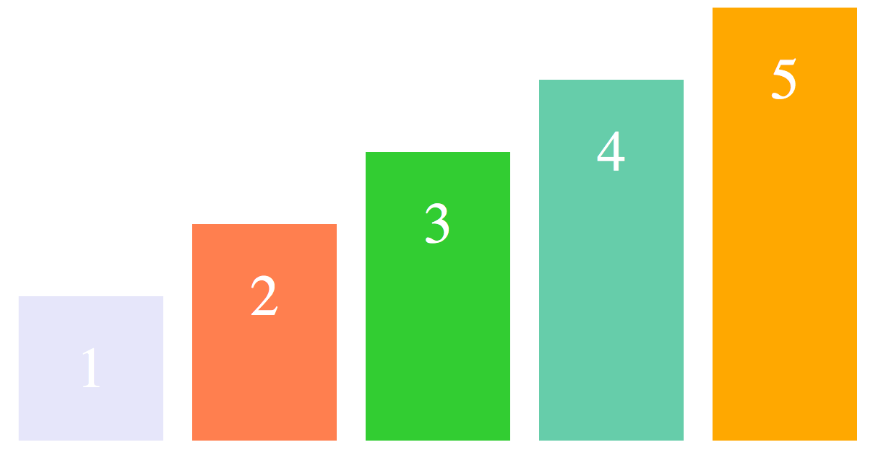

`center`：交叉轴的中点对齐

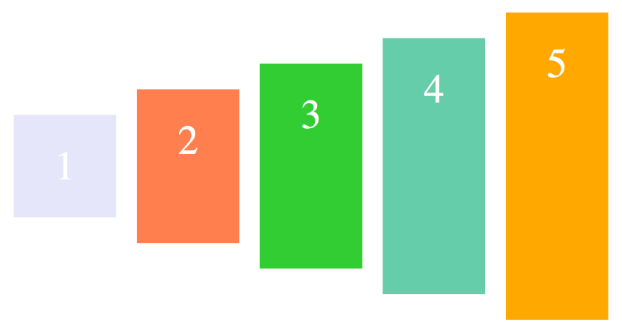

`baseline`: 项目的第一行文字的基线对齐

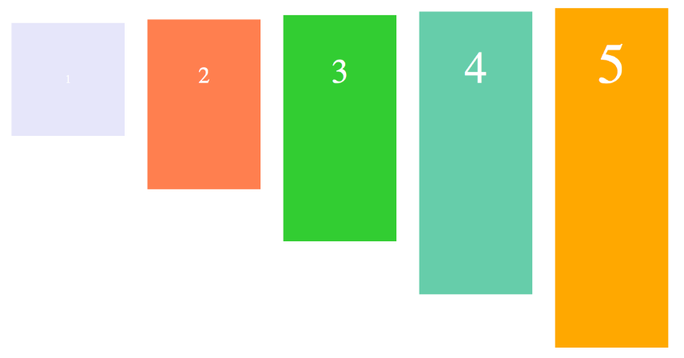

6. `align-content`: 定义了多根轴线的对齐方式，如果项目只有一根轴线，那么该属性将不起作用

```css
.container {
    align-content: flex-start | flex-end | center | space-between | space-around | stretch;
}
```

当你 `flex-wrap` 设置为 `nowrap` 的时候，容器仅存在一根轴线，因为项目不会换行，就不会产生多条轴线。

当你 `flex-wrap` 设置为 `wrap` 的时候，容器可能会出现多条轴线，这时候你就需要去设置多条轴线之间的对齐方式了。

现在设置 `flex-direction: row, flex-wrap: wrap`

默认值为 `stretch`，看下面的图就很好理解了

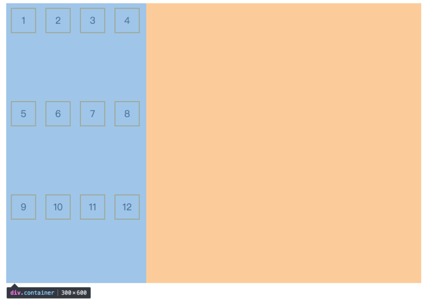

从图可以看出又三条轴线(因为容器宽度有限)，当值为 `stretch` 时会三条轴线平分容器的垂直方向上的空间。

值得注意的是，虽然在每条轴线上项目的默认值也为 `stretch`，但是由于我每个项目我都设置了高度，所以它并没有撑开整个容器。如果项目不设置高度的话就会变成下面这样：

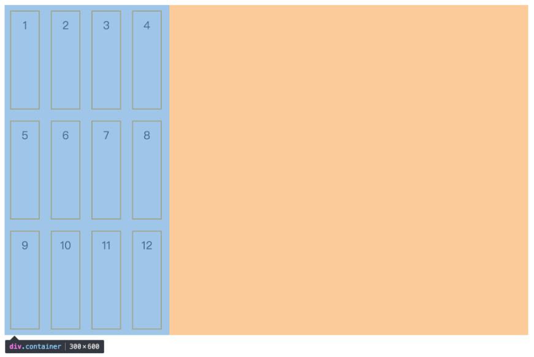

`flex-start`：轴线全部在交叉轴上的起点对齐


`flex-end`：轴线全部在交叉轴上的终点对齐

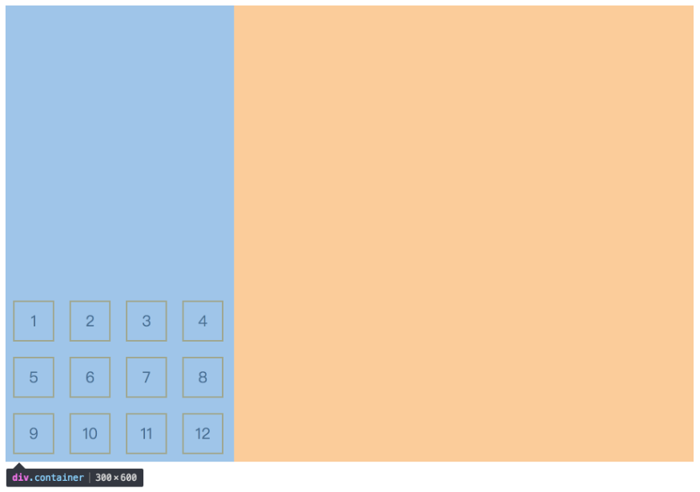

`center`：轴线全部在交叉轴上的中间对齐

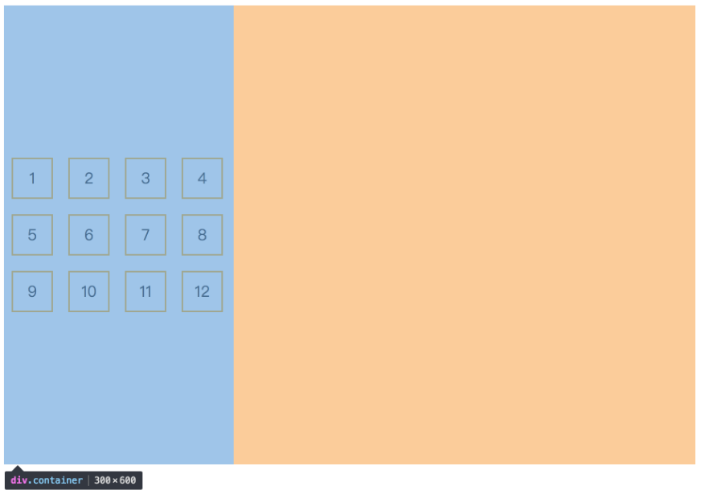

`space-between`：轴线两端对齐，之间的间隔相等，即剩余空间等分成间隙。

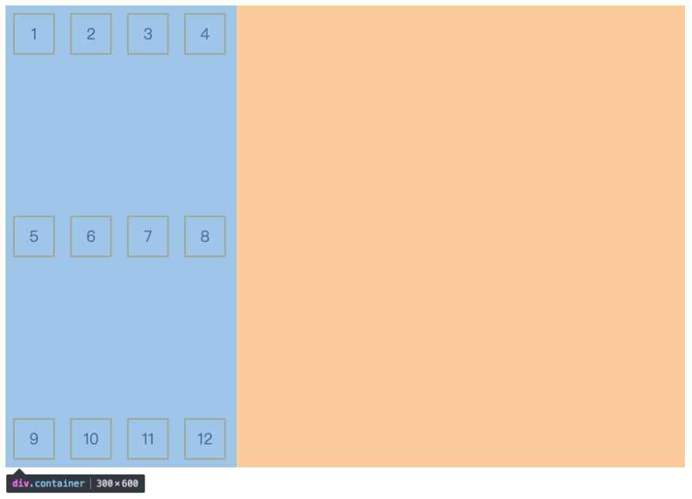

`space-around`：每个轴线两侧的间隔相等，所以轴线之间的间隔比轴线与边缘的间隔大一倍。

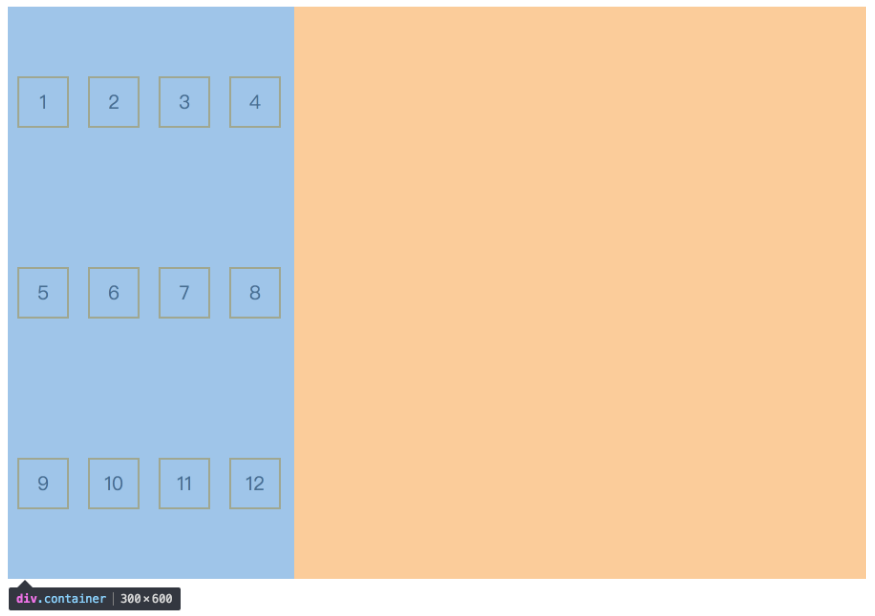

到这里关于容器上的所有属性都讲完了，接下来就来讲讲关于在 `flex item` 上的属性。

## Flex 项目属性

有六种属性可运用在 item 项目上

1. `order`: 定义项目在容器中的排列顺序，数值越小，排列越靠前，默认值为 `0`

```css
.item {
    order: <integer>;
}
```

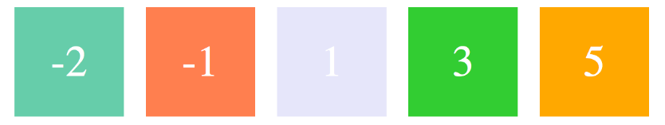

2. `flex-basis`: 定义了在分配多余空间之前，项目占据的主轴空间，浏览器根据这个属性，计算主轴是否有多余空间

```css
.item {
    flex-basis: <length> | auto;
}
```

当主轴为水平方向的时候，当设置了 `flex-basis`，项目的宽度设置值会失效，`flex-basis` 需要跟 `flex-grow` 和 `flex-shrink` 配合使用才能发挥效果。

当 `flex-basis` 值为 `0 %` 时，是把该项目视为零尺寸的，故即使声明该尺寸为 `140px`，也并没有什么用。
当 `flex-basis` 值为 `auto` 时，则跟根据尺寸的设定值(假如为 `100px`)，则这 `100px` 不会纳入剩余空间

3. `flex-grow`: 定义项目的放大比例

```css
.item {
    flex-grow: <number>;
}
```

默认值为 `0`，即如果存在剩余空间，也不放大

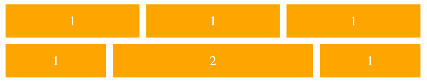

当所有的项目都以 `flex-basis` 的值进行排列后，仍有剩余空间，那么这时候 `flex-grow` 就会发挥作用了。
如果所有项目的 `flex-grow` 属性都为 `1`，则它们将等分剩余空间。(如果有的话)

如果一个项目的 `flex-grow` 属性为 `2`，其他项目都为 `1`，则前者占据的剩余空间将比其他项多一倍。

当然如果当所有项目以 `flex-basis` 的值排列完后发现空间不够了，且 `flex-wrap：nowrap` 时，此时 `flex-grow` 则不起作用了，这时候就需要接下来的这个属性。

4. `flex-shrink`: 定义了项目的缩小比例

```css
.item {
    flex-shrink: <number>;
}
```

默认值: `1`，即如果空间不足，该项目将缩小，负值对该属性无效。

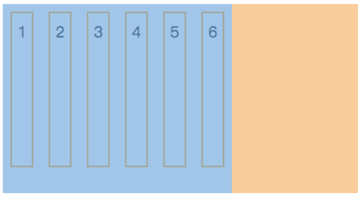

这里可以看出，虽然每个项目都设置了宽度为 `50px`，但是由于自身容器宽度只有 `200px`，这时候每个项目会被同比例进行缩小，因为默认值为 `1`。

同理可得：

如果所有项目的 `flex-shrink` 属性都为 `1`，当空间不足时，都将等比例缩小。

如果一个项目的 `flex-shrink` 属性为 `0`，其他项目都为 `1`，则空间不足时，前者不缩小。

5. `flex`: `flex-grow`, `flex-shrink` 和 `flex-basis`的简写

华丽胡哨的，略了

**总结一下，`flex-wrap` 与子项的 `flex-shrink`、`flex-grow` 之间的关系：**

当 `flex-wrap` 为 `wrap` 或 `wrap-reverse`，且子项宽度和不及父容器宽度时，`flex-grow` 会起作用，子项会根据 `flex-grow` 设定的值放大（为`0`的项不放大）

当 `flex-wrap` 为 `wrap` 或 `wrap-reverse`，且子项宽度和超过父容器宽度时，首先一定会换行，换行后，每一行的右端都可能会有剩余空间（最后一行包含的子项可能比前几行少，所以剩余空间可能会更大），这时 `flex-grow` 会起作用，若当前行所有子项的 `flex-grow` 都为`0`，则剩余空间保留，若当前行存在一个子项的 `flex-grow` 不为`0`，则剩余空间会被 `flex-grow `不为`0`的子项占据

当 `flex-wrap` 为 `nowrap`，且子项宽度和不及父容器宽度时，`flex-grow` 会起作用，子项会根据 `flex-grow` 设定的值放大（为0的项不放大）

当 `flex-wrap` 为 `nowrap`，且子项宽度和超过父容器宽度时，`flex-shrink` 会起作用，子项会根据 `flex-shrink` 设定的值进行缩小（为0的项不缩小）。但这里有一个较为特殊情况，就是当这一行所有子项 `flex-shrink` 都为`0`时，也就是说所有的子项都不能缩小，就会出现讨厌的横向滚动条


总结上面四点，可以看出不管在什么情况下，在同一时间，`flex-shrink` 和 `flex-grow` 只有一个能起作用，这其中的道理细想起来也很浅显：空间足够时，`flex-grow` 就有发挥的余地，而空间不足时，`flex-shrink` 就能起作用。当然，`flex-wrap` 的值为 `wrap` 或 `wrap-reverse` 时，表明可以换行，既然可以换行，一般情况下空间就总是足够的，`flex-shrink` 当然就不会起作用

6. `align-self`: 允许单个项目有与其他项目不一样的对齐方式

单个项目覆盖 `align-items` 定义的属性

默认值为 `auto`，表示继承父元素的 `align-items` 属性，如果没有父元素，则等同于 `stretch`

这个跟 `align-items` 属性时一样的，只不过 `align-self `是对单个项目生效的，而 `align-items` 则是对容器下的所有项目生效的。

下面例子中，第三个项目的 `align-items` 设置为了 `flex-start`

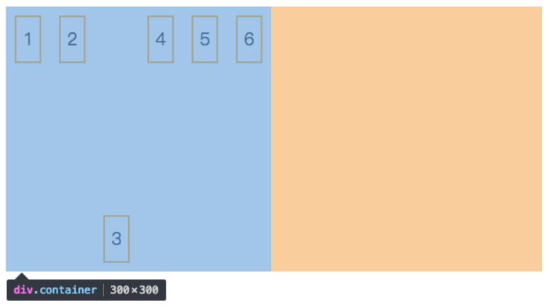

## 复述指引

* `flex`容器

`display`两种取值`flex`和`inline-flex`的作用

`flex-direction`的`row`、`row-reverse`、`column`和`column-reverse`的作用

`flex-wrap`的`nowrap`、`wrap`和`wrap-reverse`的作用

`justify-content`的`flex-start`、`flex-end`、`center`、`space-between`和`space-around`的作用

`align-items`的`flex-start`、`flex-end`、`center`、`baseline`和`stretch`的作用

`align-content`的`flex-start`、`flex-end`、`center`、`space-between`和`space-around`的作用

* `flex`项目

`order`、`flex-basis`、`flex-grow`、`flex-shrink`和`align-self`填什么，作用是什么
