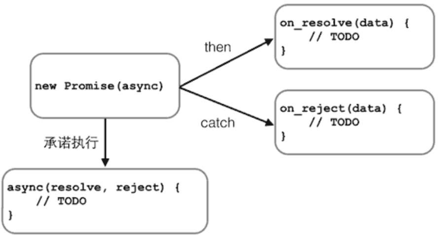

# Promise

## 是什么？

在JavaScript的世界中，所有代码都是单线程执行的。

由于这个“缺陷”，导致JavaScript的所有网络操作，浏览器事件，都必须是异步执行。异步执行可以用回调函数实现。

```js
function callback() {
    console.log('Done');
}
console.log('before setTimeout()');
setTimeout(callback, 1000); // 1秒钟后调用callback函数
console.log('after setTimeout()');
```

观察上述代码执行，在Chrome的控制台输出可以看到：

```
before setTimeout()
after setTimeout()
(等待1秒后)
Done
```

可见，异步操作会在将来的某个时间点触发一个函数调用。AJAX就是典型的异步操作。

```js
request.onreadystatechange = function () {
    if (request.readyState === 4) {
        if (request.status === 200) {
            return success(request.responseText);
        } else {
            return fail(request.status);
        }
    }
}
```

## 为什么？

把回调函数`success(request.responseText)`和`fail(request.status)`写到一个AJAX操作里很正常，但是不好看，而且不利于代码复用。

有没有更好的写法？比如写成这样：

```js
var ajax = ajaxGet('http://...');
ajax.ifSuccess(success)
    .ifFail(fail);
```

这种链式写法的好处在于，先统一执行AJAX逻辑，不关心如何处理结果，然后，根据结果是成功还是失败，在将来的某个时候调用`success`函数或`fail`函数。

古人云：“君子一诺千金”，这种“承诺将来会执行”的对象在JavaScript中称为Promise对象。Promise有各种开源实现，在ES6中被统一规范。

## 怎么做？

我们先看一个最简单的Promise例子：生成一个0-2之间的随机数，等待一段时间，如果随机数小于1，则返回成功，否则返回失败。
> 注意，这里的`resolve`和`reject`，Promise实例会自动调用。

```js
function example(resolve, reject) {
    var timeOut = Math.random() * 2;
    setTimeout(function () {
        if (timeOut < 1) {
            resolve('200 OK');
        }
        else {
            reject('timeout in ' + timeOut + ' seconds.');
        }
    }, timeOut * 1000);
}
```

这个`example()`函数有两个参数，这两个参数都是函数，如果执行成功，我们将调用`resolve('200 OK')`，如果执行失败，我们将调用`reject('timeout in ' + timeOut + ' seconds.')`。可以看出，`example()`函数**只关心自身的逻辑**，并不关心具体的`resolve`和`reject`将如何处理结果。

有了执行函数，我们就可以用一个Promise对象来执行它

```js
var p1 = new Promise(example);
var p2 = p1.then(function (result) {
    console.log('成功：' + result);
});
var p3 = p2.catch(function (reason) {
    console.log('失败：' + reason);
});
```

变量p1是一个Promise对象，它负责执行`example`函数。由于`example`函数在内部是异步执行的，当`example`函数执行成功时，我们告诉Promise对象，如果成功，执行这个函数

```js
p1.then(function (result) {
    console.log('成功：' + result);
});
```

如果`example`执行失败，我们告诉Promise对象执行这个函数

```js
p2.catch(function (reason) {
    console.log('失败：' + reason);
});
```

### 串行执行

Promise对象可以串联起来，所以上述代码可以简化为

```js
new Promise(example).then(function (result) {
    console.log('成功：' + result);
}).catch(function (reason) {
    console.log('失败：' + reason);
});
```

Promise最大的好处是在异步执行的流程中，把执行代码和处理结果的代码清晰地分离了



Promise还可以做更多的事情，比如，有若干个异步任务，需要先做任务1，如果成功后再做任务2，任何任务失败则不再继续并执行错误处理函数。

要串行执行这样的异步任务，不用Promise需要写一层一层的嵌套代码。有了Promise，我们只需要简单地写

```js
job1.then(job2).then(job3).catch(handleError);
```

其中，`job1`、`job2`和`job3`都是Promise对象。

### 并行执行

除了串行执行若干异步任务外，Promise还可以并行执行异步任务。
试想一个页面聊天系统，我们需要从两个不同的URL分别获得用户的个人信息和好友列表，这两个任务是可以并行执行的，用`Promise.all()`实现如下

```js
var p1 = new Promise(function (resolve, reject) {
    setTimeout(resolve, 500, 'P1');
});
var p2 = new Promise(function (resolve, reject) {
    setTimeout(resolve, 600, 'P2');
});
// 同时执行p1和p2，并在它们都完成后执行then:
Promise.all([p1, p2]).then(function (results) {
    console.log(results); // 获得一个Array: ['P1', 'P2']
});
```

有些时候，多个异步任务是为了容错。比如，同时向两个URL读取用户的个人信息，只需要获得先返回的结果即可。这种情况下，用`Promise.race()`实现

```js
var p1 = new Promise(function (resolve, reject) {
    setTimeout(resolve, 500, 'P1');
});
var p2 = new Promise(function (resolve, reject) {
    setTimeout(resolve, 600, 'P2');
});
Promise.race([p1, p2]).then(function (result) {
    console.log(result); // 'P1'
});
```

由于`p1`执行较快，`Promise`的`then()`将获得结果`'P1'`。`p2`仍在继续执行，但执行结果将被丢弃。

## 复述指引

* Promise对象
* 目标函数的`resovle`和`reject`
* `then`和`catch`
* `all`和`race` 