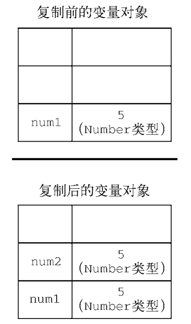
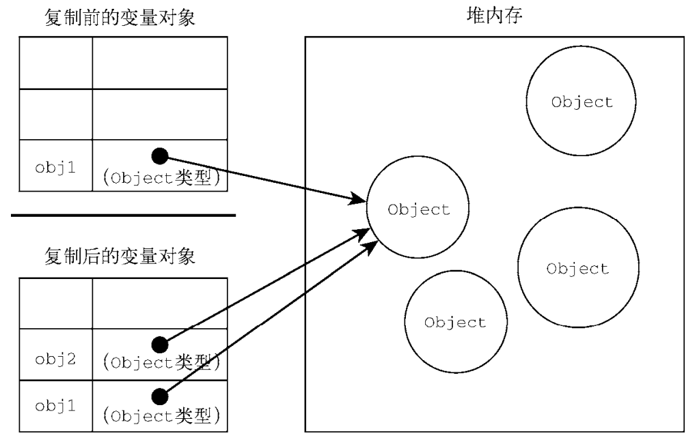

# 变量、作用域与内存 

## 原始值与引用值

ECMAScript 变量可以包含两种不同类型的数据：原始值和引用值。

原始值（primitive value）就是最简单的数据，引用值（reference value）则是由多个值构成的对象。

::: tip 提示
在把一个值赋给变量时，JavaScript 引擎必须确定这个值是原始值还是引用值。
:::

之前讨论了 6 种原始值：`undefined`、`null`、`boolean`、`number`、`string` 和 `symbol`。保存原始值的变量是按值（byvalue）访问的，因为我们操作的就是存储在变量中的实际值。

引用值是保存在内存中的对象。与其他语言不同，JavaScript 不允许直接访问内存位置。在操作对象时，实际上操作的是对该对象的引用（reference）而非实际的对象本身。

::: warning 注意
在很多语言中，字符串是使用对象表示的，因此被认为是引用类型。ECMAScript打破了这个惯例。
:::

### 动态属性

对于引用值而言，可以随时添加、修改和删除其属性和方法。

```js
let person = new Object();
person.name = "Nicholas";
console.log(person.name); // "Nicholas" 
```

这里，首先创建了一个对象，并把它保存在变量 `person` 中。然后，给这个对象添加了一个名为 `name` 的属性，并给这个属性赋值了一个字符串 `"Nicholas"`。在此之后，就可以访问这个新属性，直到对象被销毁或属性被显式地删除。

原始值不能有属性，尽管尝试给原始值添加属性不会报错。比如：

```js
let name = "Nicholas";
name.age = 27;
console.log(name.age); // undefined 
```

在此，代码想给字符串 `name` 定义一个 `age` 属性并给该属性赋值 `27`。紧接着在下一行，属性不见了。记住，只有引用值可以动态添加后面可以使用的属性。

### 复制值

在通过变量把一个**原始值**赋值到另一个变量时，原始值会被**复制**到新变量的位置。

```js
let A = 5;
let B = A;
```

这里，`A` 包含数值 `5`。当把 `B` 初始化为 `A` 时，`B` 也会得到数值 `5`。这个值跟存储在`A` 中的 `5` 是完全独立的，因为它是那个值的副本。



在把**引用值**从一个变量赋给另一个变量时，存储在变量中的值也会被复制到新变量所在的位置。区别在于，这里复制的值实际上**是一个指针**，它指向存储在堆内存中的对象。操作完成后，两个变量实际上指向同一个对象，因此一个对象上面的变化会在另一个对象上反映出来。

```js
let A = new Object();
let B = A;
A.name = "Nicholas";
console.log(B.name); // "Nicholas"
```

在这个例子中，变量 `A` 保存了一个新对象的实例。然后，这个值被复制到 `B`，此时两个变量都指向了同一个对象。在给 `A` 创建属性 `name` 并赋值后，通过 `B` 也可以访问这个属性，因为它们都指向同一个对象。



### 传递参数

ECMAScript 中**所有函数的参数都是按值传递**的。这意味着函数外的值会被复制到函数内部的参数中，就像从一个变量复制到另一个变量一样。

```js
function addTen(num) {
    num += 10;
    return num;
}

let count = 20;

let result = addTen(count);
console.log(count); // 20，没有变化
console.log(result); // 30 
```

这里，函数 `addTen()` 有一个参数 `num`，它其实是一个局部变量。在调用时，变量 `count` 作为参数传入。`count` 的值是 `20`，这个值被复制到参数 `num` 以便在 `addTen()` 内部使用。在函数内部，参数 `num` 的值被加上了 `10`，但这不会影响函数外部的原始变量 `count`。

参数 `num` 和变量 `count` 互不干扰，它们只不过碰巧保存了一样的值。

但是，如果变量中传递的是对象。

```js
function setName(obj) {
    obj.name = "Nicholas";
}

let person = new Object();
setName(person);
console.log(person.name); // "Nicholas"
```

在函数内部，`obj` 和 `person` 都指向同一个对象。结果就是，即使对象是按值传进函数的，`obj` 也会通过引用访问对象。当函数内部给 `obj` 设置了 `name` 属性时，函数外部的对象也会反映这个变化。

::: tip 说人话
原始值变量中存的真的是值。

引用值变量中存放的是值的地址，而地址本身也是一个值。
:::

### 确定类型

提到的 `typeof` 操作符最适合用来判断一个变量是否为字符串、数值、布尔值或 `undefined` 的最好方式。如果值是对象或 `null`，那么 `typeof` 返回 `"object"`。

```js
let A = "Nicholas";
let B = true;
let C = 22;
let D;
let E = null;
let F = new Object();

console.log(typeof A); // string
console.log(typeof B); // number
console.log(typeof C); // boolean
console.log(typeof D); // undefined
console.log(typeof E); // object
console.log(typeof F); // object
```

`typeof` 虽然对原始值很有用，但它对引用值的用处不大。我们通常不关心一个值是不是对象，而是想知道它是什么类型的对象。为了解决这个问题，ECMAScript 提供了 `instanceof` 操作符。

如果变量是给定引用类型（由其原型链决定，后面会有详细介绍）的实例，则 `instanceof` 操作符返回 `true`。

```js
console.log(person  instanceof Object);  // 变量 person  是 Object 吗？
console.log(colors  instanceof Array);   // 变量 colors  是 Array  吗？
console.log(pattern instanceof RegExp);  // 变量 pattern 是 RegExp 吗？
```

对了，如果用 `instanceof` 检测原始值，则始终会返回 `false`，因为原始值不是对象。

## 执行上下文与作用域

变量或函数的上下文决定了它们可以访问哪些数据，以及它们的行为。每个上下文都有一个关联的变量对象（variable object），而这个**上下文**中定义的**所有变量和函数都存在于这个对象上**。虽然无法通过代码访问变量对象，但后台处理数据会用到它。

在浏览器中，全局上下文就是我们常说的 `window` 对象。上下文在其所有代码都执行完毕后会被销毁，包括定义在它上面的所有变量和函数（全局上下文在应用程序退出前才会被销毁，比如关闭网页或退出浏览器）。

每个函数调用都有自己的上下文。当代码执行流进入函数时，函数的上下文被推到一个上下文栈上。在函数执行完之后，上下文栈会弹出该函数上下文，将控制权返还给之前的执行上下文。

上下文中的代码在执行的时候，会创建变量对象的一个作用域链（scope chain）。这个作用域链决定了各级上下文中的代码在访问变量和函数时的顺序。代码**正在执行**的上下文的变量对象始终**位于作用域链的最前端**。如果上下文是函数，则其活动对象（activation object）用作变量对象。活动对象最初只有一个定义变量：`arguments`。（全局上下文中没有这个变量。）

代码执行时的标识符解析是通过**沿作用域链逐级搜索标识符名称**完成的。搜索过程始终从作用域链的最前端开始，然后逐级往后，直到找到标识符。（如果没有找到标识符，那么通常会报错。）

```js
var color = "blue";
function changeColor() {
    if (color === "blue") {
        color = "red";
    } else {
        color = "blue";
    }
}

changeColor();
```

对这个例子而言，函数 `changeColor()` 的作用域链包含两个对象：

一个是它自己的变量对象（就是定义 `arguments` 对象的那个），另一个是全局上下文的变量对象。这个函数内部之所以能够访问变量 `color`，就是因为可以在作用域链中找到它。

内部上下文可以通过作用域链访问外部上下文中的一切，但外部上下文无法访问内部上下文中的任何东西。上下文之间的连接是线性的、有序的。每个上下文都可以到上一级上下文中去搜索变量和函数，但任何上下文都不能到下一级上下文中去搜索。（如果理解的离散数学的量词作用域也很好理解）

::: tip 提示
只要理解了“函数外无法直接访问函数内的变量”，应该问题不大。
:::

### 变量声明

1. 使用 `var` 的函数作用域声明

在使用 `var` 声明变量时，变量会被自动添加到最接近的上下文。在函数中，最接近的上下文就是函数的局部上下文。如果变量未经声明就被初始化了，那么它就会自动被添加到全局上下文。

```js
function add(num1, num2) {
    var sum = num1 + num2;
    return sum;
}

let result = add(10, 20); // 30
console.log(sum);         // 报错：sum 在这里不是有效变量
```

```js
function add(num1, num2) {
    sum = num1 + num2;
    return sum;
}

let result = add(10, 20); // 30
console.log(sum);         // 30
```

::: danger 注意
未经声明而初始化变量是 JavaScript 编程中一个非常常见的错误，会导致很多问题。为此，读者在初始化变量之前一定要先声明变量。在严格模式下，未经声明就初始化变量会报错。
:::

2. 使用 `let` 的函数作用域声明

`let` 与 `var` 的一个不同之处是在同一作用域内不能声明两次。重复的 `var` 声明会被忽略，而重复的 `let` 声明会抛出 `SyntaxError`。

而且 `let` 声明的变量也不会跑到当前作用域外边去。

3. `const` 

同上，特性不能变。略......

4. 标识符查找

如果在局部上下文中找到该标识符，则搜索停止，变量确定；如果没有找到变量名，则继续沿作用域链搜索。

```js
var color = 'blue';
function getColor() {
    return color;
}
console.log(getColor()); // 'blue'
```

```js
var color = 'blue';
function getColor() {
    let color = 'red';
    return color;
}
console.log(getColor()); // 'red' 
```

```js
var color = 'blue';
function getColor() {
    let color = 'red';
    {
        let color = 'green';
        return color;
    }
}
console.log(getColor()); // 'green'
```

## 垃圾回收

JavaScript 是使用垃圾回收的语言，也就是说执行环境负责在代码执行时管理内存。在 C 和 C++等语言中，跟踪内存使用对开发者来说是个很大的负担，也是很多问题的来源。JavaScript 为开发者卸下了这个负担。

通过自动内存管理实现内存分配和闲置资源回收。基本思路很简单：确定哪个变量不会再使用，然后释放它占用的内存。这个过程是周期性的，即垃圾回收程序每隔一定时间就会自动运行。

### 标记清理

JavaScript 最常用的垃圾回收策略是标记清理（mark-and-sweep）。当变量进入上下文，比如在函数内部声明一个变量时，这个变量会被加上存在于上下文中的标记。而在上下文中的变量，逻辑上讲，永远不应该释放它们的内存，因为只要上下文中的代码在运行，就有可能用到它们。当变量离开上下文时，也会被加上离开上下文的标记。

给变量加标记的方式有很多种。比如，当变量进入上下文时，反转某一位；或者可以维护“在上下文中”和“不在上下文中”两个变量列表，可以把变量从一个列表转移到另一个列表。标记过程的实现并不重要，关键是策略。

垃圾回收程序运行的时候，会标记内存中存储的所有变量（记住，标记方法有很多种）。然后，它会将所有在上下文中的变量，以及被在上下文中的变量引用的变量的标记去掉。在此之后再被加上标记的变量就是待删除的了，原因是任何在上下文中的变量都访问不到它们了。随后垃圾回收程序做一次内存清理，销毁带标记的所有值并收回它们的内存。

### 引用计数

另一种没那么常用的垃圾回收策略是引用计数（reference counting）。其思路是对每个值都记录它被引用的次数。声明变量并给它赋一个引用值时，这个值的引用数为 1。如果同一个值又被赋给另一个变量，那么引用数加 1。类似地，如果保存对该值引用的变量被其他值给覆盖了，那么引用数减 1。当一个值的引用数为 0 时，就说明没办法再访问到这个值了，因此可以安全地收回其内存了。垃圾回收程序下次运行的时候就会释放引用数为 0 的值的内存。

### 内存管理

JavaScript 运行在一个内存管理与垃圾回收都很特殊的环境。分配给浏览器的内存通常比分配给桌面软件的要少很多，分配给移动浏览器的就更少了。

将内存占用量保持在一个较小的值可以让页面性能更好。优化内存占用的最佳手段就是保证在执行代码时只保存必要的数据。如果数据不再必要，那么把它设置为 `null`，从而释放其引用。这也可以叫作**解除引用**。

这个建议最适合全局变量和全局对象的属性。局部变量在超出作用域后会被自动解除引用

1. 隐藏类和删除操作

Chrome 是最流行的浏览器，使用 V8 JavaScript 引擎。V8 在将解释后的 JavaScript代码编译为实际的机器码时会利用“隐藏类”。如果你的代码非常注重性能，那么这一点可能对你很重要。

运行期间，V8 会将创建的对象与隐藏类关联起来，以跟踪它们的属性特征。能够共享相同隐藏类的对象性能会更好，V8 会针对这种情况进行优化。

```js
function Article() {
    this.title = 'Inauguration Ceremony Features Kazoo Band';
}
let a1 = new Article();
let a2 = new Article();
```

V8 会在后台配置，让这两个类实例共享相同的隐藏类，因为这两个实例共享同一个构造函数和原型。假设之后又添加了下面这行代码:

```js
a2.author = 'Jake';
```

此时两个 `Article` 实例就会对应两个不同的隐藏类。根据这种操作的频率和隐藏类的大小，这有可能对性能产生明显影响。当然，解决方案就是避免 JavaScript 的“先创建再补充”（ready-fire-aim）式的动态属性赋值。

不过，使用 `delete` 关键字会导致生成相同的隐藏类片段。

```js
function Article() {
    this.title = 'Inauguration Ceremony Features Kazoo Band';
    this.author = 'Jake';
}
let A = new Article();
let B = new Article();
delete A.author;
```

在代码结束后，即使两个实例使用了同一个构造函数，它们也不再共享一个隐藏类。动态删除属性与动态添加属性导致的后果一样。最佳实践是把不想要的属性设置为 `null`。这样可以保持隐藏类不变和继续共享，同时也能达到删除引用值供垃圾回收程序回收的效果。

2. 内存泄漏

* 意外声明全局变量是最常见但也最容易修复的内存泄漏问题。

```js
function setName() {
    name = 'Jake';
}
```

* 定时器也可能会悄悄地导致内存泄漏。

只要定时器一直运行，回调函数中引用的 `name` 就会一直占用内存。垃圾回收程序当然知道这一点，因而就不会清理外部变量。

```js
let name = 'Jake';
setInterval(() => {
    console.log(name);
}, 100);
```

* 使用 JavaScript 闭包很容易在不知不觉间造成内存泄漏。

调用 `outer()` 会导致分配给 `name` 的内存被泄漏。以上代码执行后创建了一个内部闭包，只要返回的函数存在就不能清理 `name`，因为闭包一直在引用着它。假如 `name` 的内容很大（不止是一个小字符串），那可能就是个大问题了。

```js
let outer = function () {
    let name = 'Jake';
    return function () {
        return name;
    };
};
```

4. 静态分配与对象池

为了提升 JavaScript 性能，最后要考虑的一点往往就是压榨浏览器了。此时，一个关键问题就是如何减少浏览器执行垃圾回收的次数。开发者无法直接控制什么时候开始收集垃圾，但可以间接控制触发垃圾回收的条件。


```js
function addVector(a, b) {
    let resultant = new Vector();
    resultant.x = a.x + b.x;
    resultant.y = a.y + b.y;
    return resultant;
}
```

调用这个函数时，会在堆上创建一个新对象，然后修改它，最后再把它返回给调用者。如果这个矢量对象的生命周期很短，那么它会很快失去所有对它的引用，成为可以被回收的值。假如这个矢量加法函数频繁被调用，那么垃圾回收调度程序会发现这里对象更替的速度很快，从而会更频繁地安排垃圾回收。

该问题的解决方案是不要动态创建矢量对象，比如可以修改上面的函数，让它使用一个已有的矢量对象。

```js
function addVector(a, b, resultant) {
    resultant.x = a.x + b.x;
    resultant.y = a.y + b.y;
    return resultant;
}
```

当然，这需要在其他地方实例化矢量参数 `resultant`，但这个函数的行为没有变。那么在哪里创建矢量可以不让垃圾回收调度程序盯上呢？

一个策略是使用对象池。在初始化的某一时刻，可以创建一个对象池，用来管理一组可回收的对象。应用程序可以向这个对象池请求一个对象、设置其属性、使用它，然后在操作完成后再把它还给对象池。由于没发生对象初始化，垃圾回收探测就不会发现有对象更替，因此垃圾回收程序就不会那么频繁地运行。

```js
// 假设 vectorPool 是已有的对象池
let v1 = vectorPool.allocate();
let v2 = vectorPool.allocate();
let v3 = vectorPool.allocate();

v1.x = 10;
v1.y = 5;
v2.x = -3;
v2.y = -6;

addVector(v1, v2, v3);

console.log([v3.x, v3.y]); // [7, -1]

vectorPool.free(v1);
vectorPool.free(v2);
vectorPool.free(v3);

// 如果对象有属性引用了其他对象
// 则这里也需要把这些属性设置为 null
v1 = null;
v2 = null;
v3 = null;
```

如果对象池只按需分配矢量（在对象不存在时创建新的，在对象存在时则复用存在的），那么这个实现本质上是一种贪婪算法，有单调增长但为静态的内存。这个对象池必须使用某种结构维护所有对象，数组是比较好的选择。不过，使用数组来实现，必须留意不要招致额外的垃圾回收。

由于 JavaScript 数组的大小是动态可变的，引擎会删除大小为 100 的数组，再创建一个新的大小为200 的数组。垃圾回收程序会看到这个删除操作，说不定因此很快就会跑来收一次垃圾。要避免这种动态分配操作，可以在初始化时就创建一个大小够用的数组，从而避免上述先删除再创建的操作。不过，必须事先想好这个数组有多大。

::: warning 注意
静态分配是优化的一种极端形式。如果你的应用程序被垃圾回收严重地拖了后腿，可以利用它提升性能。但这种情况并不多见。大多数情况下，这都属于过早优化，因此不用考虑。
:::

## 小结

JavaScript 变量可以保存两种类型的值：原始值和引用值。原始值可能是以下 6 种原始数据类型之一：`undefined`、`null`、`boolean`、`number`、`string` 和 `symbol`。原始值和引用值有以下特点。

* 原始值大小固定，因此保存在栈内存上。
* 从一个变量到另一个变量复制原始值会创建该值的第二个副本。
* 引用值是对象，存储在堆内存上。
* 包含引用值的变量实际上只包含指向相应对象的一个指针，而不是对象本身。
* 从一个变量到另一个变量复制引用值只会复制指针，因此结果是两个变量都指向同一个对象。
* `typeof` 操作符可以确定值的原始类型，而 `instanceof` 操作符用于确保值的引用类型。任何变量（不管包含的是原始值还是引用值）都存在于某个执行上下文中（也称为作用域）。这个上下文（作用域）决定了变量的生命周期，以及它们可以访问代码的哪些部分。执行上下文可以总结如下。
* 执行上下文分全局上下文、函数上下文和块级上下文。
* 代码执行流每进入一个新上下文，都会创建一个作用域链，用于搜索变量和函数。
* 函数或块的局部上下文不仅可以访问自己作用域内的变量，而且也可以访问任何包含上下文乃至全局上下文中的变量。
* 全局上下文只能访问全局上下文中的变量和函数，不能直接访问局部上下文中的任何数据。
* 变量的执行上下文用于确定什么时候释放内存。JavaScript 是使用垃圾回收的编程语言，开发者不需要操心内存分配和回收。JavaScript 的垃圾回收程序可以总结如下。
* 离开作用域的值会被自动标记为可回收，然后在垃圾回收期间被删除。
* 主流的垃圾回收算法是标记清理，即先给当前不使用的值加上标记，再回来回收它们的内存。
* 引用计数是另一种垃圾回收策略，需要记录值被引用了多少次。JavaScript 引擎不再使用这种算法，但某些旧版本的 IE 仍然会受这种算法的影响，原因是 JavaScript 会访问非原生 JavaScript 对象（如 DOM 元素）。
* 引用计数在代码中存在循环引用时会出现问题。
* 解除变量的引用不仅可以消除循环引用，而且对垃圾回收也有帮助。为促进内存回收，全局对象、全局对象的属性和循环引用都应该在不需要时解除引用。